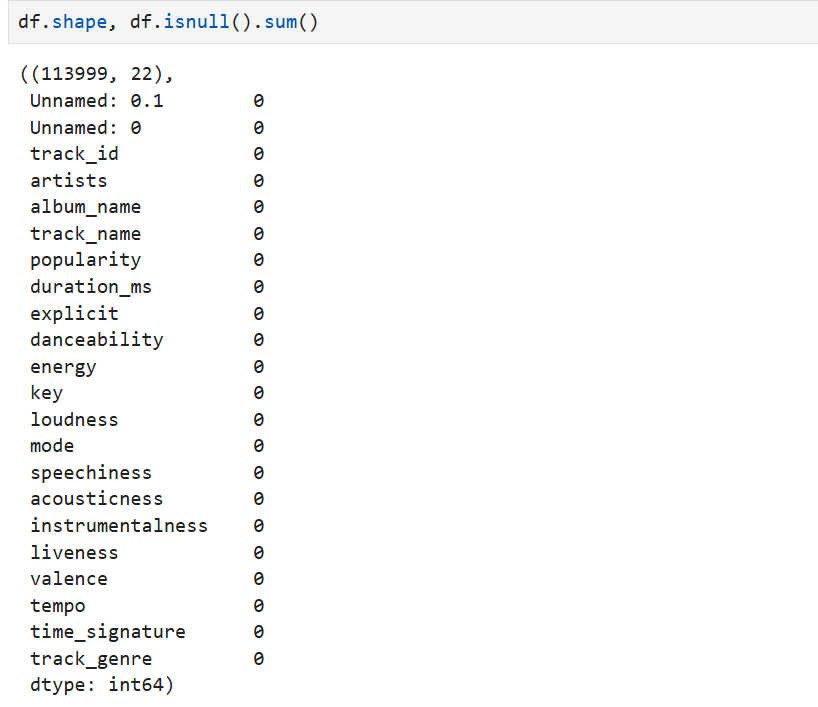
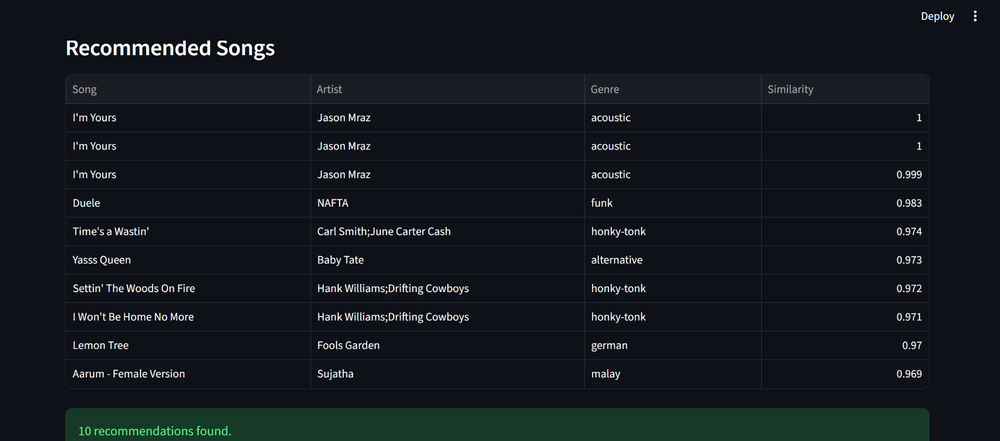
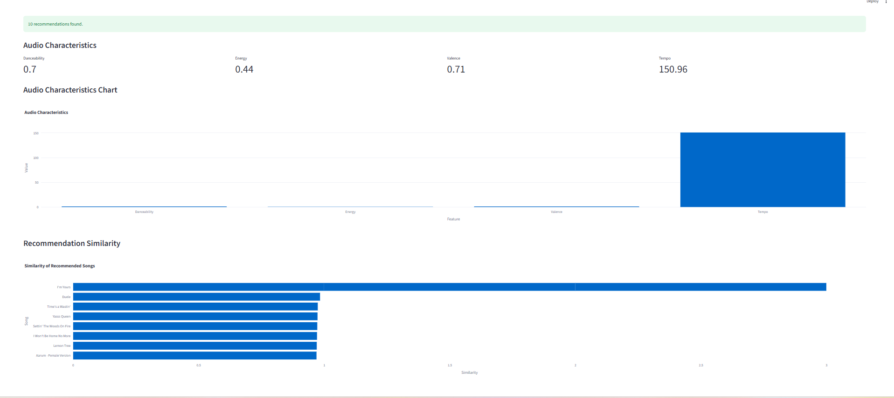

🎵 Music Recommendation System
📌 Project Overview

The Music Recommendation System is a machine learning project that recommends songs similar to a selected song based on audio characteristics.

The system analyzes music features and uses similarity-based recommendations to find songs with similar audio patterns.

🚀 Features
Select a song
Choose number of recommendations
Filter recommendations by genre
Display artist information
Display genre information
Display similarity score
Show danceability
Show energy
Show valence
Show tempo
Audio characteristics chart
Recommendation similarity chart
Interactive Streamlit dashboard
🛠️ Technologies Used
Python
Pandas
NumPy
Scikit-learn
Matplotlib
Plotly
Streamlit
Jupyter Notebook
Git
GitHub
📊 Dataset

The project uses a music dataset containing song information and audio features.

Important features include:

track_name
artists
track_genre
danceability
energy
valence
tempo
loudness
speechiness
acousticness
instrumentalness
liveness
🤖 Machine Learning

The recommendation system uses numerical audio features to measure similarity between songs.

The main workflow is:

Dataset
   ↓
Data Cleaning
   ↓
Exploratory Data Analysis
   ↓
Feature Selection
   ↓
Feature Scaling
   ↓
Similarity Calculation
   ↓
Recommendation System
   ↓
Streamlit Application
🎯 How the Recommendation Works

A user selects a song from the application.

The system obtains the audio features of that song and compares them with other songs.

Songs with similar audio characteristics are returned as recommendations.

The application displays a similarity score for each recommendation.

💻 Run the Project

Clone the repository:

git clone https://github.com/Kirtan0024/Music-Recommendation-System.git

Open the project:

cd Music-Recommendation-System

Install the required libraries:

pip install -r requirements.txt

Run the Streamlit application:

streamlit run app.py

The application will open in your browser.

📁 Project Structure
Music-Recommendation-System/
│
├── data/
│   └── songs.csv
│
├── notebooks/
│   └── music_recommendation.ipynb
│
├── models/
│   ├── songs.pkl
│   ├── knn.pkl
│   ├── X_scaled.pkl
│   └── song_indices.pkl
│
├── screenshots/
│   ├── eda.png
│   ├── recommendation.png
│   └── dashboard.png
│
├── app.py
├── requirements.txt
├── README.md
└── .gitignore

📸 ## Screenshots

EDA
### EDA

Recommendation Output

### Recommendation System

Streamlit Dashboard

### Dashboard

🔮 Future Improvements
Add album artwork
Add song preview
Add popularity filtering
Add personalized recommendations
Add recommendation history
Deploy the application online

👤 Author
Kirtan Parmar
GitHub: @Kirtan0024 "# Music-Recommendation-System"